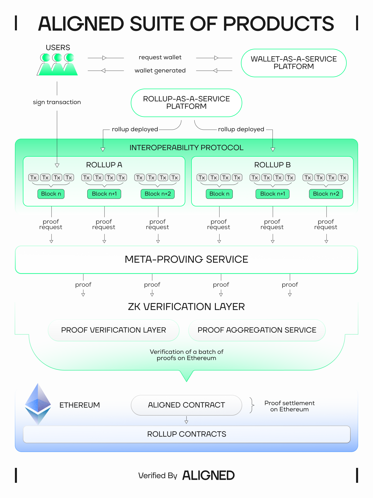

## What is Aligned?

Aligned is a vertically integrated stack for building applications on a verifiable internet. Whether it's financial infrastructure or AI systems, we provide the foundation for provable execution with one-click solutions for wallets, rollups, interoperability, and ZK services in a world where trust is no longer a given.

## Mission

Aligned is creating the foundation for a trustless, verifiable internet. Our vertically integrated stack empowers developers to build applications across finance, AI, and other sectors with one-click solutions for wallets, rollups, and zero-knowledge services on Ethereum. We’re focused on enabling provable execution in a world where institutional trust is increasingly fragile.

By providing the tools for trust to be integrated into every layer of application infrastructure, we’re enabling developers to create verifiable systems that can be trusted across a wide range of use cases. Aligned is here to enable a future where trust is not assumed, but proven by design.


If you are unfamiliar with ZK and why this is useful, see [Why ZK and Aligned?](./4_why_zk.md)


## What real value does Aligned bring to the table?

Aligned is building a full stack of vertically integrated infrastructure designed to make it easier for teams to launch, operate, and scale on Ethereum.

Aligned suite of products and services includes:

- ZK Verification Layer (offering Proof Verification Layer and Proof Aggregation Service)
- Rollup-as-a-Service (RaaS) Platform
- Meta-Proving Services
- Interoperability Protocol
- Wallet-as-a-Service

Read more: [The Aligned Roadmap](https://blog.alignedlayer.com/the-aligned-roadmap-ethereum-as-a-financial-backend/)

By vertically integrating our stack we can provide the best developer experience and highest performance at the lowest possible cost.

- Fully open-source—no proprietary code or licenses
- Simplicity and minimalism—easy to maintain
- Modular and flexible—customizable to meet your business needs
- Future-proofed—designed to support emerging technologies

Whether you’re a seasoned crypto builder or an enterprise launching your first blockchain project, Aligned gives you the tools to deploy powerful Ethereum-native infrastructure without compromising on security, performance, or flexibility.

As Ethereum continues to be adopted as the financial backend of the internet, we are committed to helping developers and companies tap into its security and global, 24/7 liquidity.

## What limits the development of more complex applications on top of blockchains?

The main limitation for building complex applications on top of blockchains has been that the computation can run only a few milliseconds on-chain, and even then, this can be costly. You can't have millions of daily active users using Ethereum or any blockchain at the same time.

ZK solves this, but due to slow and complex-to-use proving and expensive verification, progress has been limited. In the case of proving, before the development of general-purpose zero-knowledge virtual machines (zkVMs), users had to express their computation as arithmetic circuits, making the developer experience something like coding in assembler, error-prone, and complex. Moreover, proof systems depended on trusted setups, adding additional trust guarantees, the need to carry out special ceremonies to initialize parameters, and delaying go-to-market times. Besides, having high verification costs (on the order of 10's to 100's of dollars per proof) meant that only those projects with a huge capital could afford to build such applications.

## How much can Aligned Aligned’s ZK Verification Layer reduce costs?

Aligned’s ZK Verification Layer operates using two operation modes: Proof Verification Layer and Proof Aggregation Service. The cost reduction depends on throughput, proof system, and mode used. For the least expensive systems, such as Groth16, this can amount to nearly 90%, while STARKs can be nearly 99%. Moreover, Aligned’s stack allows the verification of proofs that cannot be currently verified in Ethereum due to cost or size, such as Kimchi or Binius. The verification cost using Aligned services is independent of the proof system, giving the choice of the proof system back to developers.

## How does Aligned’s stack compare to other solutions?

Aligned has created a new category in crypto: ZK verification layer. It is the only solution for now offering Proof Verification and Proof Aggregation modes while being linked to Ethereum via EigenLayer. The Proof Verification Layer provides very high throughput (over two orders of magnitude more than Ethereum), low latency, and lower costs than the Proof Aggregation Layer. The security is provided by restaking, and this mode is well suited for applications with tight limits on latency and costs. The Proof Aggregation Layer works using the slower proof recursion strategy, also used in rollups to compress proofs. Another key feature is that Aligned’s approach is stateless, simplifying the process greatly.

Other solutions focus on building a separate L1 for proof verification (which sets them apart from Ethereum and requires bootstrapping the economic security, which can be lowered and subject to volatility, as opposed to that provided by restaking) or focus on the aggregation of proofs from a few proof systems. This last approach adds latency, higher operational costs, and constrains the developer's choice of the proof system.

The following table contains cost estimates for Aligned, assuming a batch size of 20 proofs.

| Proof system | Ethereum   | Aligned's Proof Verification Layer | Aligned's Proof Aggregation Service |
| ------------ | ---------- | ------------------- | --------------------- |
| Groth16      | 250,000    | 40,000              | TBD                   |
| STARKs       | >1,000,000 | 40,000              | TBD                   |
| Kimchi-IPA   | ??????     | 40,000              | TBD                   |
| Binius.      | ??????     | 40,000              | TBD                   |

## Why is Aligned building its stack?

Aligned is building its stack to provide the foundational infrastructure for a trustless, verifiable internet. Aligned’s vertically integrated stack empowers developers to build applications across industries like finance and AI, offering one-click solutions for rollups, wallets, and several zero-knowledge (ZK) services.

In recent months, we have witnessed the development and enhancement of general proving virtual machines such as Risc0, Valida, Jolt, and SP1. These innovations allow users to write ordinary code in languages like Rust or C and generate proofs demonstrating the integrity of computations. This evolution is poised to transform application development, provided we have verification networks with high throughput and low cost. This is the core vision of Aligned and the reason we are building it: the future belongs to provable applications.

Currently, proof verification in Ethereum is expensive and throughput is limited to around 10 proofs per second. The cost depends on the proof system used, and the availability of precompiles. Groth16 costs around 250,000 gas, STARKs, over 1,000,000, and other proof systems are too expensive to be used in Ethereum.

Proof technology has been evolving over the last decade, with new arguments, fields, commitments and other tools appearing every day. It is hard to try new ideas if verification costs are high, and there is a considerable go-to-market time, as a consequence of development time of new, gas-optimized smart contracts, or the inclusion of new precompiles to make them affordable.

Aligned’s stack provides an alternative to reduce costs and increase throughput significantly. This is achieved by two different products: Proof Verification Layer and Proof Aggregation Service.

The Proof Verification Layer works with a subset of Ethereum’s validators via restaking. Validators (also known as Operators) receive proofs, verify them using the verification code written in Rust or any other higher-level language, and then sign messages with BLS signatures. If a two-thirds (2/3) majority agrees, the results are posted in Ethereum.

Since Aligned’s operators only need to run the verification code on bare metal, we have several advantages compared to running it on top of the EVM:

- The code can be optimized for speed, not gas consumption.
- We can leverage parallelization to increase throughput.
- Since the gas limit does not constrain us, we can verify proof systems that are too expensive for Ethereum, such as Kimchi or Binius.
- Adding new proof systems is straightforward.

Preliminary numbers show that Aligned’s Verification Layer can verify more than 1000 proofs per second, over two orders of magnitude more than the EVM at nominal capacity. Using effective batching techniques, we can split the task creation and verification cost between thousands of proofs.

On the other hand, Aligned’s Proof Aggregation service enables cost-efficient ZK proof verification by combining multiple proofs into one using recursive proof aggregation. It can be used standalone or with our Proof Verification Layer. Ideal for services like rollups that require Ethereum’s full security but can tolerate higher latency.

To complement these verification capabilities, Aligned’s Meta-proving Services offers an easy interface for accessing centralized and decentralized proving from external providers. Many developers building programs on Aligned with zkVMs will want to delegate proving to different service providers. To address this, we will have a simple SDK that allows developers to code in Rust and easily send their programs for proving to their preferred services.

Aligned’s stack also provides a one-click solution for wallets and rollups. With Aligned’s Wallet-as-a-service infrastructure, developers can easily generate embedded wallets for users, supporting rollups and mobile integrations. It will leverage the latest account abstraction technology, offering seamless wallet services backed by our robust tech stack. And rollups Aligned's RaaS platform simplifies ZK-rollup deployment, allowing clients to launch L2 chains without needing deep blockchain expertise. It streamlines the process for developers and is also adding support for based rollups, a crucial element of Ethereum’s roadmap.

As a key component of Aligned’s vision, Aligned’s Interoperability Protocol will offer an intent-based bridge that will be integrated with our RaaS stack. It will leverage based sequencing and enable developers to create native trust-minimized solutions for users and financial institutions to efficiently move liquidity across chains.
With each of these products, we are taking concrete steps toward fulfilling our mission of building a trustless and verifiable internet. By providing developers with the tools to create scalable, efficient, and secure applications, Aligned is tackling the fundamental challenges of trust that have long hindered the potential of blockchain and decentralized technologies.

## Future additions

- Propagation of the results to different L2s
