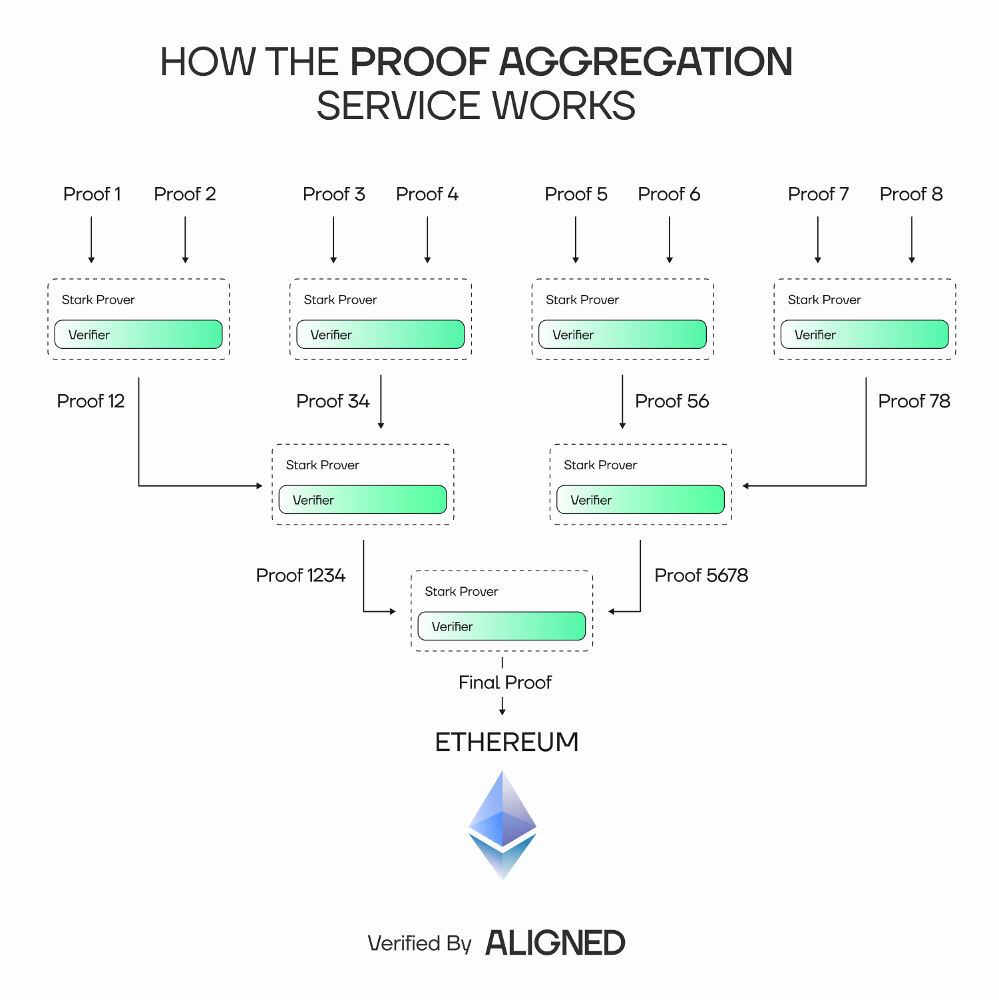

## Aligned's Proof Aggregation Service in a nutshell

Aligned's Proof Aggregation Service introduces a scalable solution: compressing multiple proofs into one using recursion, drastically reducing verification costs while maintaining Ethereum-level security. This is our second major product, following the Proof Verification Layer, and is designed to give developers flexible, cost-efficient infrastructure for proving systems.

Aggregation Service allows developers to submit individual ZK proofs to Aligned’s Verification Layer; the ones that can be aggregated are then batched and passed to the Aggregation Service. The service generates a single recursive proof that attests to the validity of these proofs. This final proof is then submitted and verified on Ethereum. By aggregating many proofs into one, the cost of on-chain verification is amortized across the batch—developers effectively pay a fraction of the full price, plus a small aggregation fee.

The system is powered by recursive proving. In simple terms, the aggregation process proves that the verification of multiple proofs was correctly executed. This meta-proof is cryptographically valid and can be verified on Ethereum just like any standard ZK proof.
