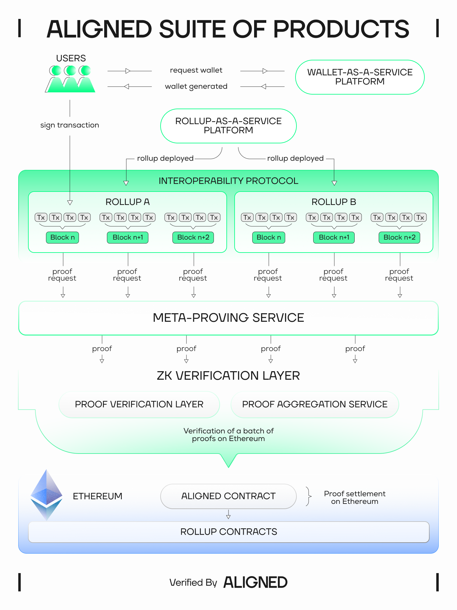
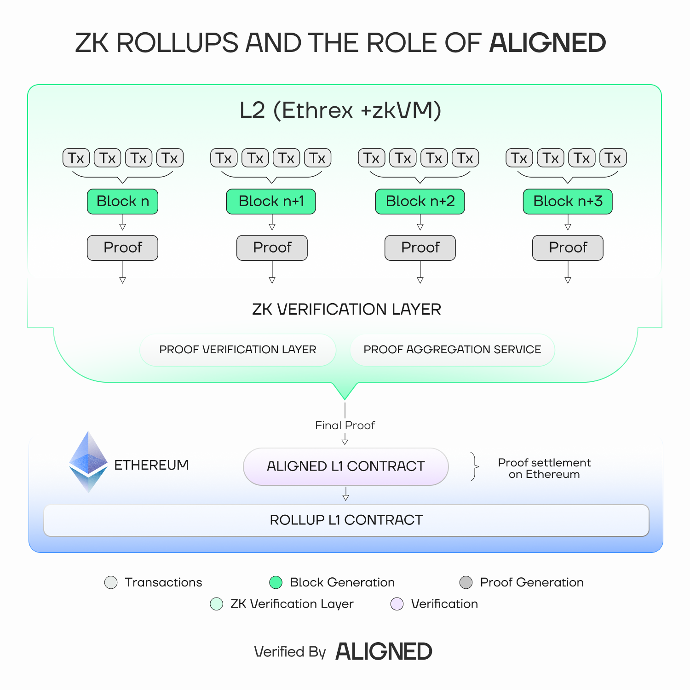

# Rollup-as-a-Service (RaaS) platform

Aligned's RaaS platform integrates RISC-V zkVMs, the new [Ethrex execution client](https://github.com/lambdaclass/ethrex), and our ZK Verification Layer to offer fast, reliable, and secure one-click ZK-rollup deployment — including full support for based rollups — making it as simple as launching a Web2 service.

Our RaaS platform will be integrated with our upcoming products to give developers all the tools they need to operate a complete ecosystem: wallet-as-a-service infrastructure for simplified onboarding, meta-proving services that give users access to provers provided by Aligned or other third-party centralized or decentralized proving services, and our interoperability protocol for efficient cross-chain liquidity access.

## What advantages will Aligned's RaaS platform offer for your project?

Aligned's RaaS platform will offer significant benefits, starting with substantial time and cost savings, enabling teams to deploy rollups faster and more affordably. This accessibility unlocks new use cases that would otherwise be economically unfeasible. A key advantage is customizability and modularity. Our platform will enable easy mixing and matching of different rollup components, helping build the ideal solution for specific needs. From initial deployment to long-term maintenance, we handle upgrades, performance optimization, and assist you in integrating new capabilities as they emerge.

## Why is Aligned using Ethrex for Based ZK-rollups?

Aligned chose Ethrex as the rollup stack for our RaaS platform due to its stable, minimalist, and modular design and its support for the latest features like based rollups. This aligns with our commitment to reliability and performance, and ensures that we can continue to offer our users the best technology to access Ethereum.

Ethrex operates in two modes:

- Ethrex L1: a streamlined Ethereum execution client
- Ethrex L2: a ZK-rollup client supporting multiple proving systems (RISC-V zkVMs like SP1 or R0VM, and Trusted Execution Environments (TEEs))

Ethrex's design principles emphasize minimalism, clarity, and simplicity, resulting in a codebase that is both fast and resilient. This approach enables rapid iteration and the early adoption of next-generation features, which is crucial for staying ahead in the rapidly evolving blockchain landscape. Additionally, Ethrex's vertical integration and minimal dependencies ensure efficient operation and ease of maintenance, enabling low overhead and providing a robust foundation for our services.

By leveraging Ethrex, Aligned can offer a streamlined, high-performance RaaS platform that simplifies the deployment of Layer 2 chains, empowering developers to build scalable applications with greater efficiency and control.

## What are Based rollups?

Based rollups are rollups that use Ethereum L1 proposers and builders for sequencing (ordering its transactions and forming blocks), as opposed to a separate (typically centralized) sequencer. 

Based sequencing is “based on the L1”, meaning that rollups using this design give Ethereum’s validators the power to sequence rollup transactions. This simplifies what a rollup needs to do and lets it take advantage of the extensive, battle-tested infrastructure that makes up Ethereum’s block building market. The result is a rollup architecture that offers greater feature parity with the L1 and many other benefits that are important to customers looking to launch their own rollup.

## The benefits of Based Rollups

Based rollups provide a range of benefits that address many of the shortcomings rollups currently face. Because non-based rollups are not synchronously composable with Ethereum their proliferation has resulted in liquidity fragmentation and the majority of DeFi volume taking place on the L1, which has higher fees. Based rollups enable atomic synchronous composability and full access to Ethereum’s liquidity, ultimately resulting in improved interoperability between apps and smart contracts and greatly improved UX.

By eliminating the need for a dedicated sequencer, based rollups are inherently more decentralized, have stronger liveness guarantees, are more censorship-resistant, and more credibly neutral than non-based rollups. These are core features of Ethereum that make it the best decentralized smart contract platform for high-value, global transactions—features which non-based rollups fail to replicate.

Based rollups benefit from reduced operating costs as they don’t require operators to run a dedicated sequencer, but also make use of the L1s existing block building pipeline. This means based rollups do not need to attract sophisticated actors to provide these services, further reducing costs and improving efficiency.

## How do ZK-rollups use Aligned’s ZK Verification Layer?

A simplified version of this process can be found in Figure 2. Proofs for batches of rollup transactions (blocks) are sent to Aligned’s ZK Verification Layer (the Proof Aggregation Service, used with or without the Proof Verification Layer), which converts them into one proof that is verified on Aligned's L1 contract.

